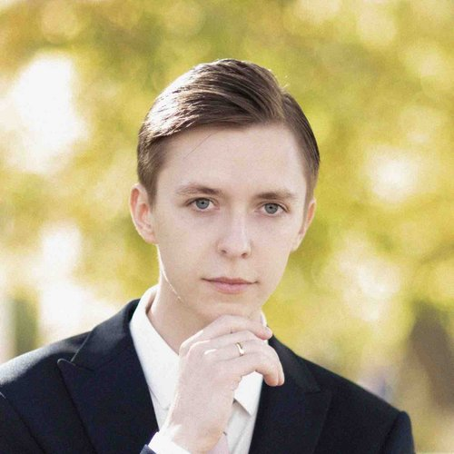

# Bogdan Korshunov

**Frontend Developer**

## Contacts
* **Discord:** Bogdan (@bogdankorshunov)
* **Telegram:** @AnsRvns
* **Mail:** korshunov.oren@gmail.com

## About
Hi!

My name is Bogdan. I study frontend and design.
I have about a year of experience as a frontend developer. I consider it my strong point to always strive for the ideal.

## Skills
* HTML
* CSS
* JS
* VUE
* Tailwind CSS
* Vuetify
* Element UI
* Figma

## Code example
[Codewars: Even Odd](https://www.codewars.com/kata/53da3dbb4a5168369a0000fe)
```JS
function even_or_odd(number) {
  return number % 2 == 0 ? "Even" : "Odd"
}
```

## Work experience
1. Development of interfaces for the medical platform
2. Development of interfaces for communication service

## Education
* 2021 - JavaScript v2.0 Course (itGid)
* 2020 - HTML, CSS Course (Vadim Prokopchuk)
* 2018 - English Language (Language Link)

## Languages
* Russian
* English - B2